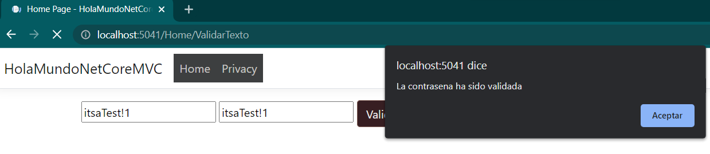
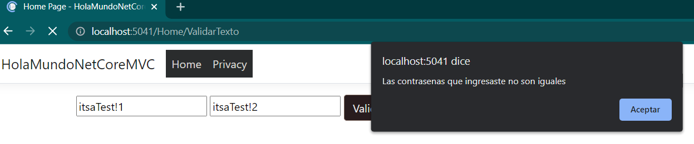
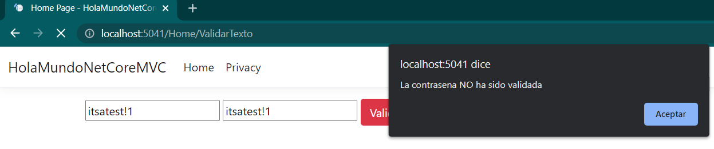
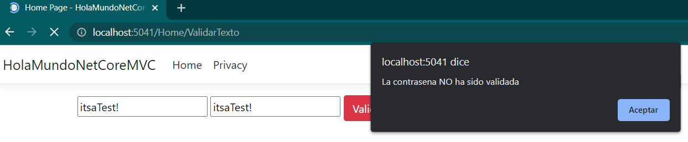
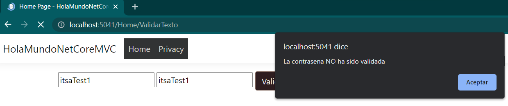
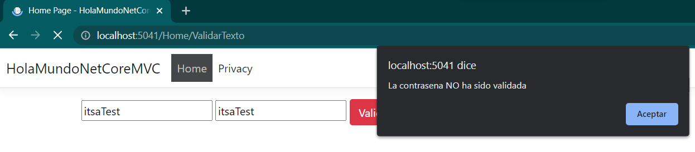
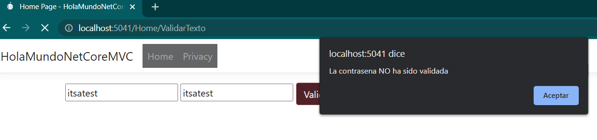
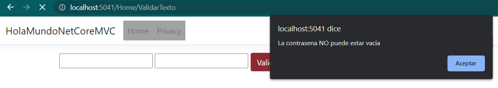
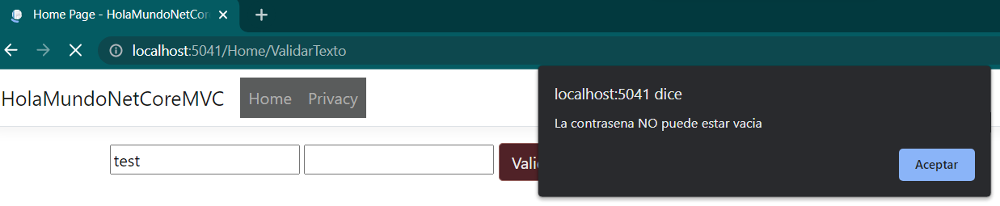
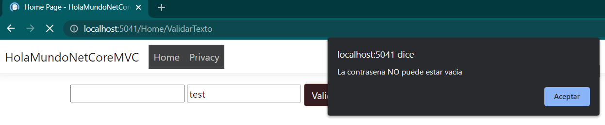

# hola-mundo-net-core
Repositorio para un formulario simple con ASP.NET Core

## Capturas de pantalla de la validación de contraseñas

### Contraseña válida

### Contraseña inválida
Contraseñas válida pero las contraseñas no coinciden

### Las siguientes capturas muestran la validación de la expresión regular
Contraseñas inválidas dado que falta una letra mayúscula

Contraseñas inválidas dado que falta una número

Contraseñas inválidas dado que falta una símbolo

Contraseñas inválidas dado que falta una símbolo, y un número

Contraseñas inválidas dado que falta una letra mayúscula, una símbolo, y un número

### Campos de contraseña vacíos
Cuando ambos campos están vacíos

Cuando solo el primer campo está vacío

Cuando solo el segundo campo está vacío

